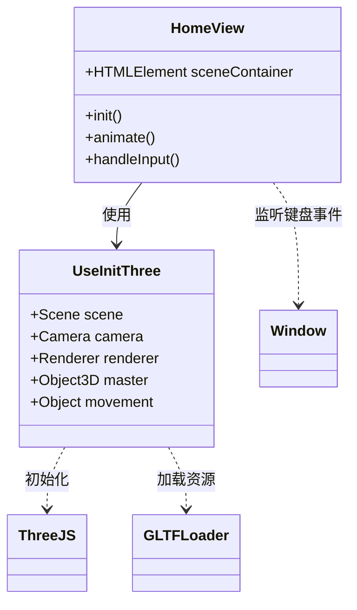

# 项目架构

## 1. 概览
本项目是一个基于 **Vue 3** 和 **Three.js** 构建的 3D Web 应用程序。它包含交互式的 3D 场景，包括一个带有动态几何体动画的文字展示页面，以及一个可控制的 3D 角色模型页面。

## 2. 技术栈
- **框架**: Vue 3 (Composition API)
- **构建工具**: Vite
- **开发语言**: TypeScript
- **3D 库**: Three.js
- **路由**: Vue Router
- **样式**: SCSS / CSS
- **辅助工具**: lil-gui (调试 UI), gltf-loader (模型加载)

## 3. 目录结构
```text
src/
├── assets/          # 静态资源 (CSS, 图片)
├── router/          # 路由配置
├── utils/           # 工具函数
├── views/           # 页面组件
│   ├── Composable/  # 组合式 API 逻辑 (Three.js 设置)
│   ├── HomeView.vue # 角色控制场景
│   └── Text.vue     # 文字与几何体动画场景
├── App.vue          # 根组件
└── main.ts          # 应用入口文件
```

## 4. 架构图

### 组件与路由架构
```mermaid
graph TD
    App[App.vue] --> RouterView
    
    subgraph 路由系统
        RouterView -->|/| Text[Text.vue]
        RouterView -->|/dog| Home[HomeView.vue]
    end

    Text --> ThreeScene1[Three.js 场景<br/>(文字 + 甜甜圈)]
    Home --> UseInitThree[Composable: useInitThree]
    UseInitThree --> ThreeScene2[Three.js 场景<br/>(柴犬模型)]
```

### 数据流与逻辑


## 5. 关键模块

### 视图 (Views)
- **Text.vue**: 落地页。渲染 3D 文字以及背景中漂浮的甜甜圈几何体。包含一个 `lil-gui` 面板用于调试参数（如半径、管道粗细等）。
- **HomeView.vue**: "小狗"页面。加载一个 GLTF 模型（柴犬），并实现了键盘控制（方向键）来移动角色。

### 组合式函数 (Composables)
- **useInitThree.ts**: 封装了设置 Three.js 场景的样板代码（场景、相机、渲染器、灯光、辅助器）。目前它还专门处理了柴犬模型的加载。

### 工具 (Utils)
- **index.ts**: 包含辅助函数，例如用于正确解析资源路径的 `getBaseUrl`。
